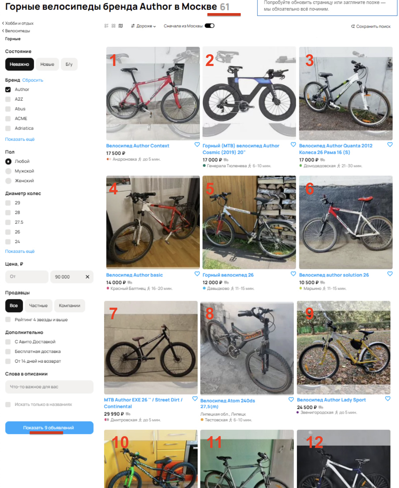
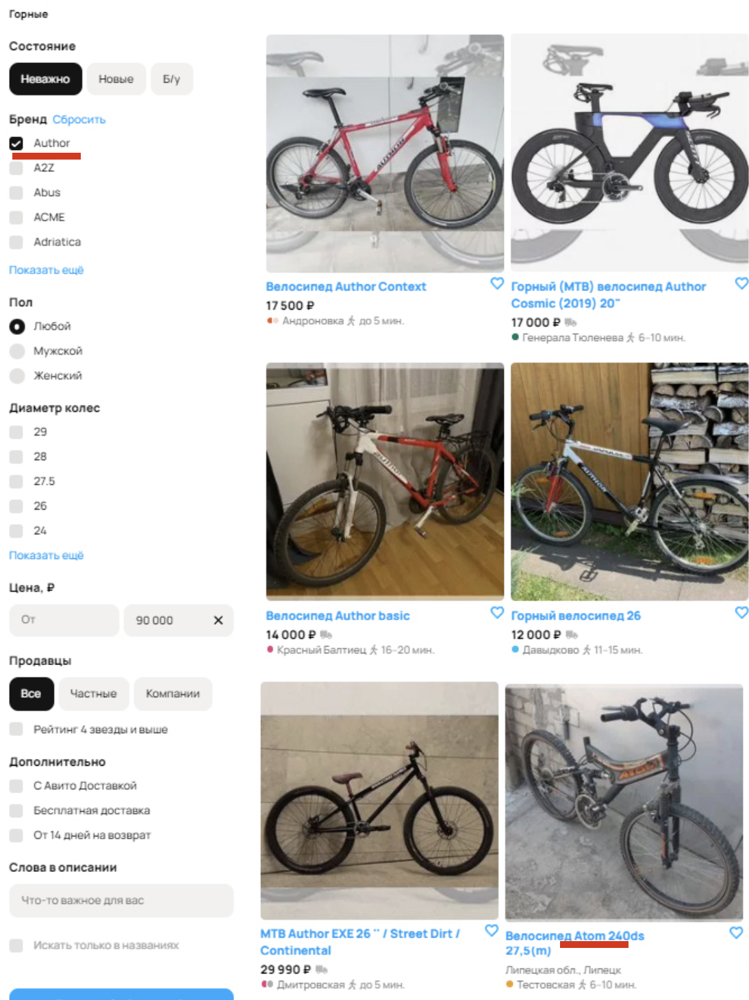
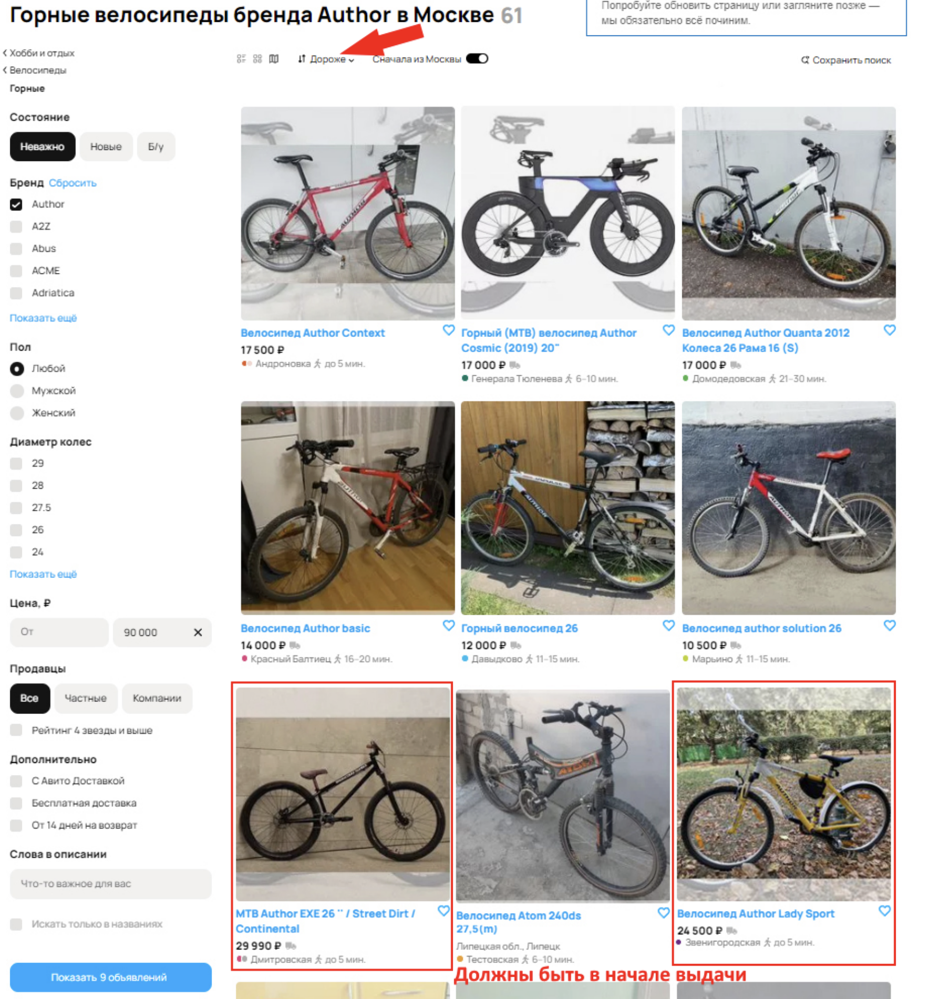
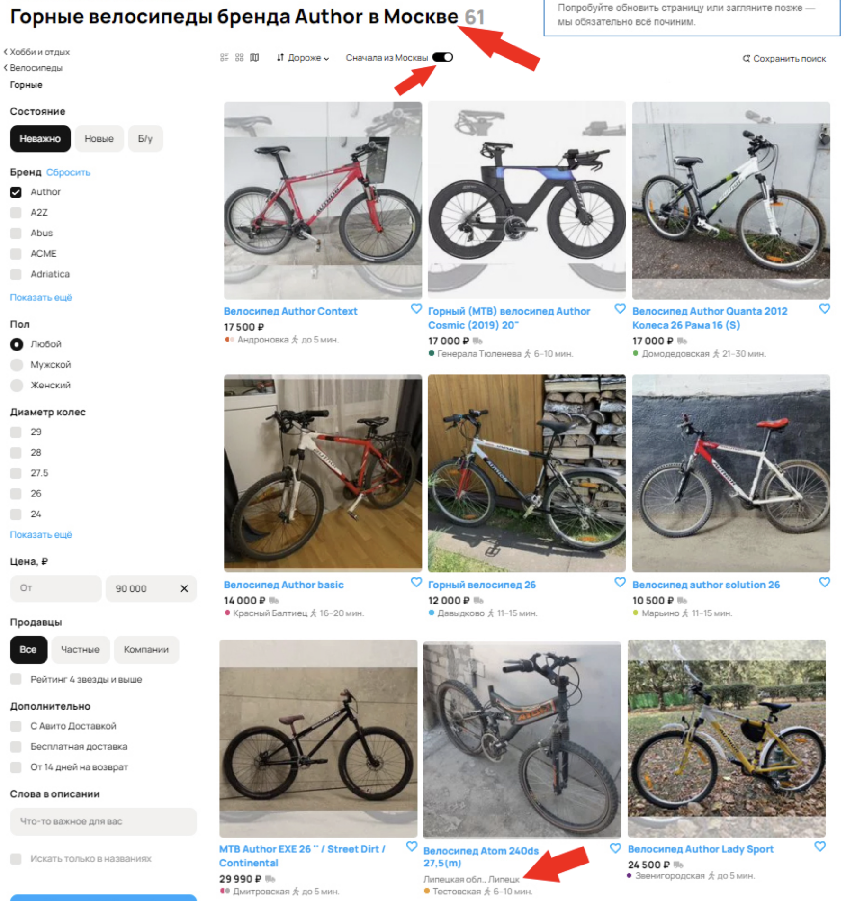
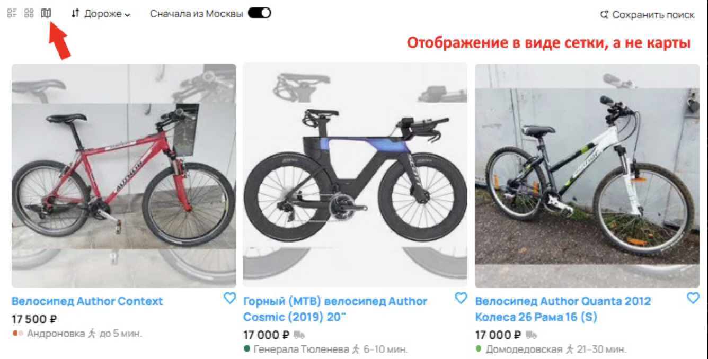
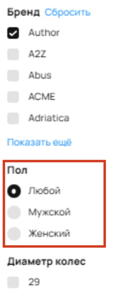
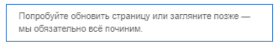
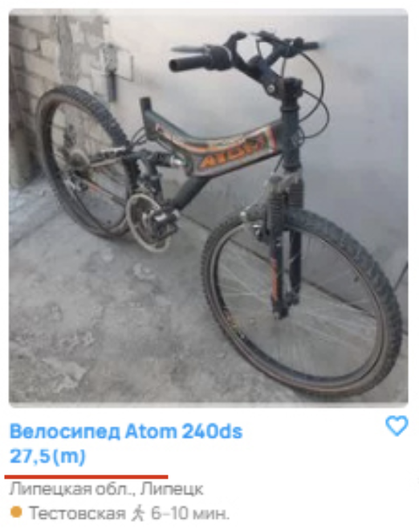
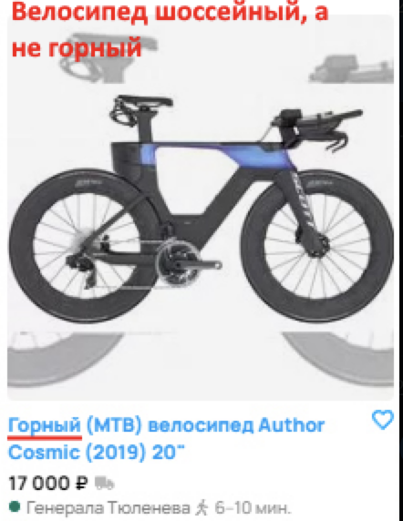
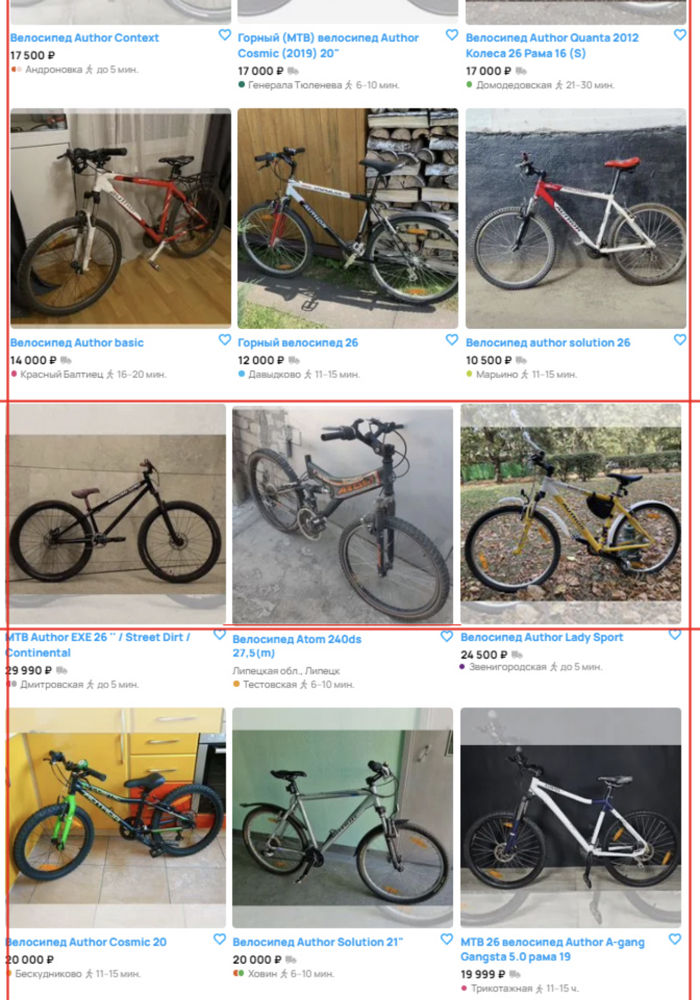

## Решение к Заданию 1

| ID  | Название бага                                     | Приоритет | Описание                                                                                                                  | Вложение                 |
|-----|----------------------------------------------------|-----------|---------------------------------------------------------------------------------------------------------------------------|-----------------|
| 1   | Несоответствие числа результатов и отображаемых товаров | **high**   | На странице указано «61 объявление», однако фактически видно только 12 объявлений, и при этом в фильтре заявлено 9. Это вводит пользователя в заблуждение. |
| 2   | Фильтр «Бренд: Author» не ограничивает результаты | **high**   | При выборе бренда «Author» отображаются велосипеды других брендов. Это ключевая функция поиска, и её некорректная работа влияет на релевантность выдачи. |
| 3   | Сортировка по цене «Дороже» не работает           | **medium** | При переключении на сортировку по убыванию цены объявления располагаются в произвольном порядке, без учёта фактической стоимости. |
| 4   | Сортировка «Сначала из Москвы» некорректна        | **medium** | Ожидается, что все товары из Москвы будут отображены первыми, но в выдаче встречаются объявления из других регионов, расположенные выше московских. |
| 5   | Ошибка в выборе режима отображения                | **medium** | На скриншоте заметно, что визуально показывается «сетка» или «блочная» верстка, однако переключатель «блоками» не активен. Это сбивает с толку при выборе режима просмотра. |
| 6   | Фильтр «Пол» неактуален для раздела «Велосипеды»  | **low**    | Параметр «Пол» (мужской/женский) для поиска горных велосипедов выглядит лишним, так как большинство велосипедов не классифицируется по этому признаку. |
| 7   | Некорректная подпись «Все категори»               | **low**    | Вместо «Все категории» отображается «Все категори» (пропущена буква «и»), что является опечаткой и портит внешний вид интерфейса. |
| 8   | Неправильное отображение времени            | **low**    | Вместо мин. время от метро указано в часах (ч.), такое отображение не несёт смысловой функциональности для пользователя |
| 9   | Уведомление об ошибке в правом верхнем углу       | **medium** | Видно сообщение «Попробуйте обновить страницу…», указывающее на сбой загрузки или проблему на сервере. Пользователь не понимает, какие данные не были загружены. |
| 10  | Некорректное количество страниц (пагинация)       | **medium** | При 61 объявлении и отображении по 12 объявлений на странице должно быть не более 6 страниц. Однако интерфейс показывает «100 страниц», что явно неверно. |
| 11  | Отсутствие цены в объявлении       | **medium** | У объявления отсутсвует поле цены и его значение, что лишает пользователя части основной информации об объявлении. Также, из-за этого, возможно, съехала верстка «сетки». |
| 12  | Некорректное изображение в объявлении       | **low** | В объявлении изображение не соответствует названию и выбранному фильтру. Возможно ошибка была допущена на стадии модерации объявления |
| 13  | Съехала верстка «сетки»       | **low** | В выдаче объявлений нарушено следование верстки «сетка», из-за чего они нарушают общую визуальную целостность выдачи |

### Комментарии по приоритизации
- **High**: Баги, которые непосредственно влияют на основной функционал поиска (количество найденных товаров, корректность фильтра).
- **Medium**: Ошибки, создающие путаницу или частично затрудняющие работу пользователя (неработающая сортировка, неверная пагинация).
- **Low**: Визуальные или контентные мелочи, которые не мешают пользоваться сайтом, но могут повлиять на общее впечатление (опечатки, неактуальные фильтры, неверное направление иконки).
